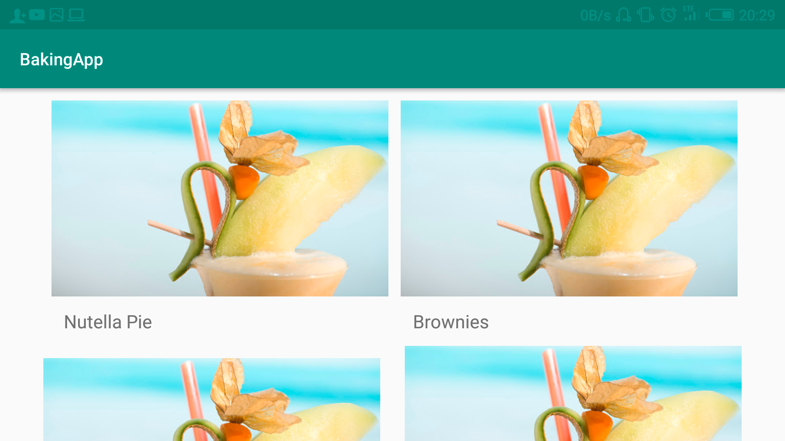
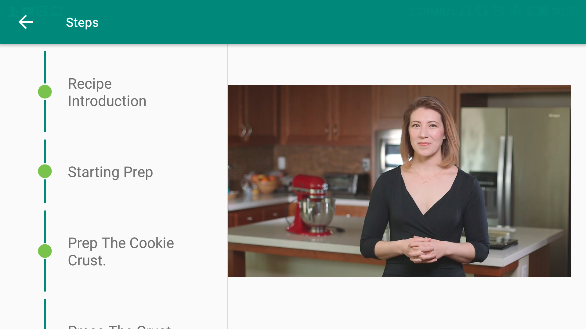

# Baking App
## Project Overview
You will productionize an app, taking it from a functional state to a production-ready state. This will involve finding and handling error cases, adding accessibility features, allowing for localization, adding a widget, and adding a library.

## Why this Project?
As a working Android developer, you often have to create and implement apps where you are responsible for designing and planning the steps you need to take to create a production-ready app. Unlike Popular Movies where we gave you an implementation guide, it will be up to you to figure things out for the Baking App.

## What Will I Learn?
In this project you will:

- Use MediaPlayer/Exoplayer to display videos.
- Handle error cases in Android.
- Add a widget to your app experience.
- Leverage a third-party library in your app.
- Use Fragments to create a responsive design that works on phones and tablets.

## Libraries
- Retrofit2
- Picasso
- Exoplayer
- Espresso
- ButterKnife

## ScreenShots

  
   
  
   

   

   

